# Casos de Uso — LUNA

Diagramas de flujo funcionales con Mermaid para cada caso de uso principal.

---

## Índice

1. [Registro y Onboarding](#1-registro-y-onboarding)
2. [Inicio de Sesión y Autenticación Biométrica](#2-inicio-de-sesión)
3. [Registro de Ciclo Menstrual](#3-registro-de-ciclo-menstrual)
4. [Registro de Síntomas Diarios](#4-registro-de-síntomas-diarios)
5. [Predicción de Ciclo](#5-predicción-de-ciclo)
6. [Inicio de Embarazo](#6-inicio-de-embarazo)
7. [Registro de Movimientos Fetales](#7-registro-de-movimientos-fetales)
8. [Registro de Síntomas Menopáusicos](#8-registro-de-síntomas-menopáusicos)
9. [Lectura de Contenido Educativo](#9-lectura-de-contenido-educativo)
10. [Invitación de Acompañante Familiar](#10-invitación-de-acompañante)
11. [Búsqueda de Profesional](#11-búsqueda-de-profesional)
12. [Participación en Foro](#12-participación-en-foro)
13. [Exportación de Reporte de Salud](#13-exportación-de-reporte)
14. [Notificaciones y Recordatorios](#14-notificaciones-y-recordatorios)
15. [Cambio de Etapa de Vida](#15-cambio-de-etapa-de-vida)

---

## 1. Registro y Onboarding

**Descripción**: Una nueva usuaria se registra, selecciona su etapa de vida y configura su perfil inicial de salud.

**Actores**: Usuaria no autenticada, Sistema

**Tablas involucradas**: `users`, `accounts`, `sessions`, `health_profiles`, `verifications`

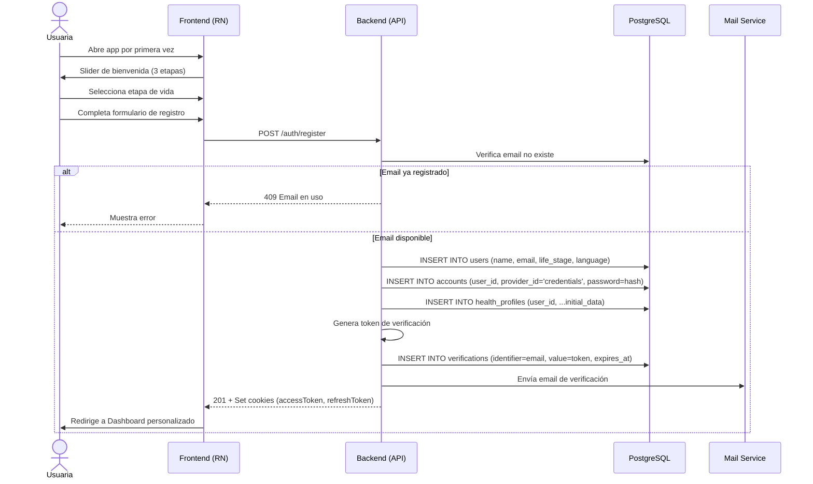

---

## 2. Inicio de Sesión

**Descripción**: Una usuaria existente inicia sesión con email/password o mediante autenticación biométrica.

**Actores**: Usuaria, Sistema

**Tablas involucradas**: `users`, `accounts`, `sessions`, `login_logs`

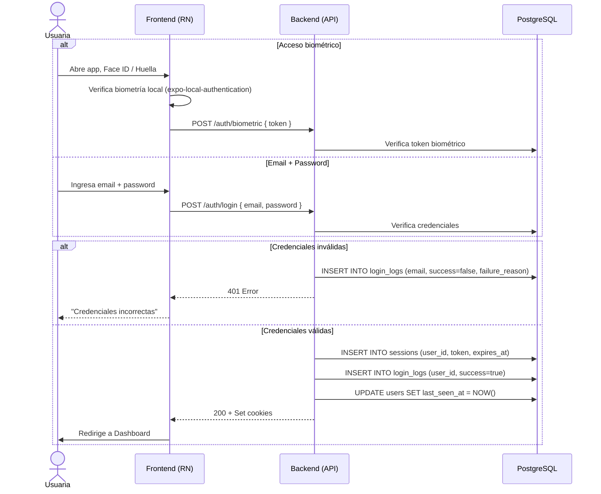

---

## 3. Registro de Ciclo Menstrual

**Descripción**: Una usuaria registra el inicio de su período menstrual con intensidad de flujo y síntomas.

**Actores**: Usuaria, Sistema

**Tablas involucradas**: `cycles`, `cycle_days`, `symptoms`

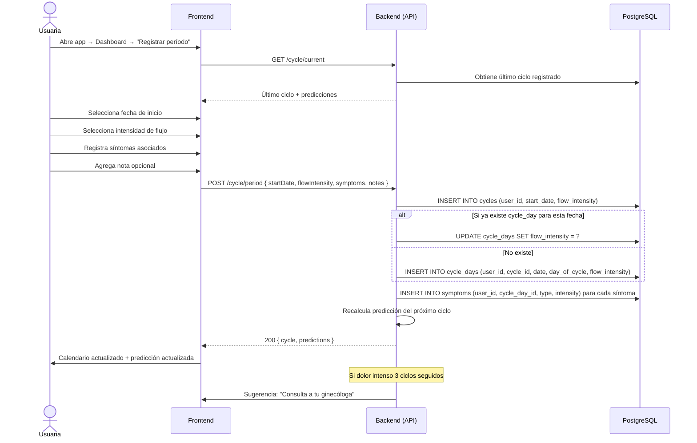

---

## 4. Registro de Síntomas Diarios

**Descripción**: Una usuaria registra síntomas, estado de ánimo y calidad del sueño en un día específico.

**Actores**: Usuaria, Sistema

**Tablas involucradas**: `cycle_days`, `symptoms`

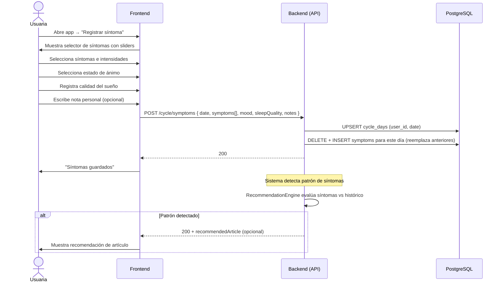

---

## 5. Predicción de Ciclo

**Descripción**: El sistema calcula automáticamente la próxima menstruación, ventana fértil y ovulación basado en el historial.

**Actores**: Sistema (automático), Usuaria (consulta)

**Tablas involucradas**: `cycles`, `cycle_days`

```mermaid
sequenceDiagram
    participant S as CyclePredictor
    participant DB as PostgreSQL
    participant B as Backend (API)
    participant F as Frontend

    Note over S: Trigger: nuevo ciclo registrado
    S->>DB: SELECT * FROM cycles WHERE user_id = ? ORDER BY cycle_number DESC LIMIT 6
    S->>S: Calcula promedio de duración de ciclo
    S->>S: Calcula promedio de duración de período
    S->>S: Estima ventana fértil (método del calendario)
    S->>S: Calcula nivel de confianza según regularidad
    S->>DB: Guarda predicciones (en cache o como datos calculados)
    S-->>B: Predicción actualizada

    Note over B,F: Usuaria consulta
    U as Usuaria
    U->>F: Abre calendario / dashboard
    F->>B: GET /cycle/predictions
    B-->>F: { nextPeriodDate, fertileWindow, ovulationDate, confidence }

    Note over F: Renderiza calendario con colores
    F->>U: 🔴 Período esperado | 🟢 Ventana fértil | 💧 Ovulación
```

---

## 6. Inicio de Embarazo

**Descripción**: Una usuaria cambia su etapa a embarazo, ingresa su FUM y el sistema calcula la FPP y semana gestacional.

**Actores**: Usuaria, Sistema

**Tablas involucradas**: `pregnancies`, `appointments`, `users`

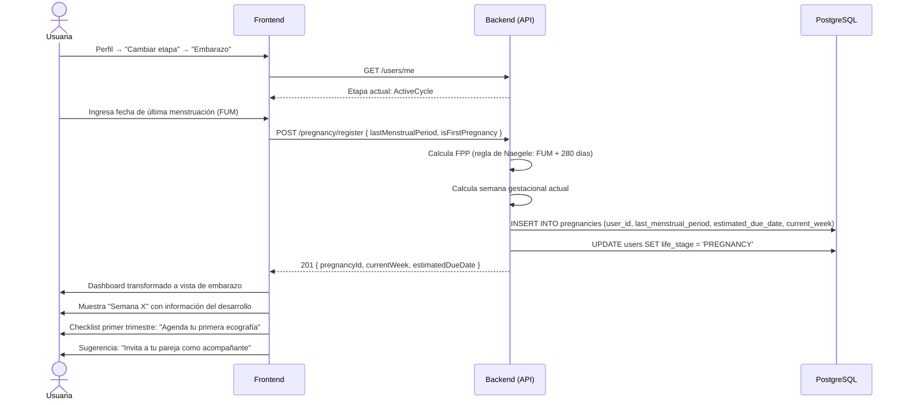

---

## 7. Registro de Movimientos Fetales

**Descripción**: Una usuaria registra una sesión de conteo de patadas para monitorear la actividad fetal.

**Actores**: Usuaria, Sistema

**Tablas involucradas**: `fetal_movements`

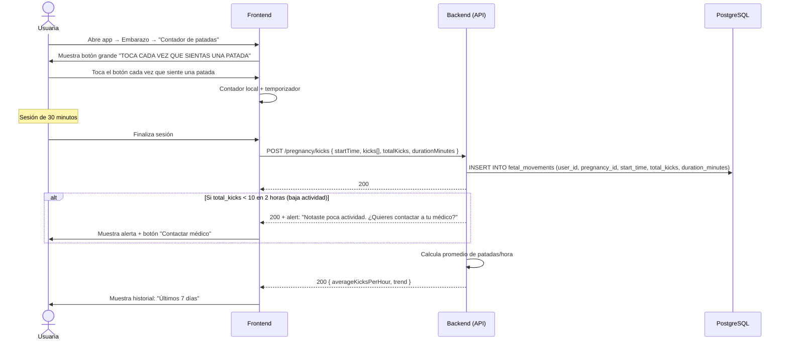

---

## 8. Registro de Síntomas Menopáusicos

**Descripción**: Una usuaria en etapa de menopausia registra sus síntomas con intensidad y frecuencia.

**Actores**: Usuaria, Sistema

**Tablas involucradas**: `menopause_tracking`, `menopause_symptom_logs`

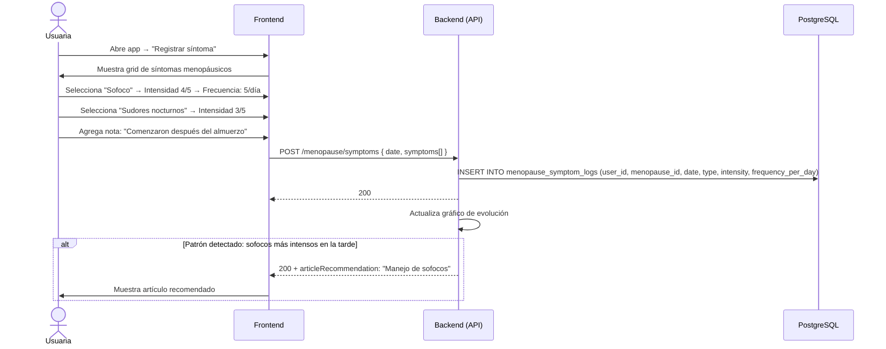

---

## 9. Lectura de Contenido Educativo

**Descripción**: Una usuaria lee un artículo de la biblioteca, posiblemente en una lengua originaria.

**Actores**: Usuaria, Sistema

**Tablas involucradas**: `articles`, `article_translations`

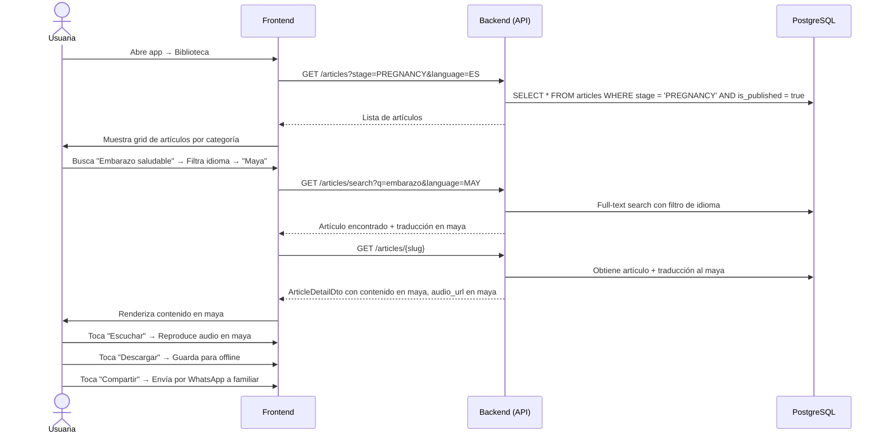

---

## 10. Invitación de Acompañante

**Descripción**: Una usuaria invita a un familiar como acompañante para que reciba contenido de apoyo y vea su calendario compartido.

**Actores**: Usuaria, Familiar, Sistema

**Tablas involucradas**: `family_members`, `users`, `family_messages`

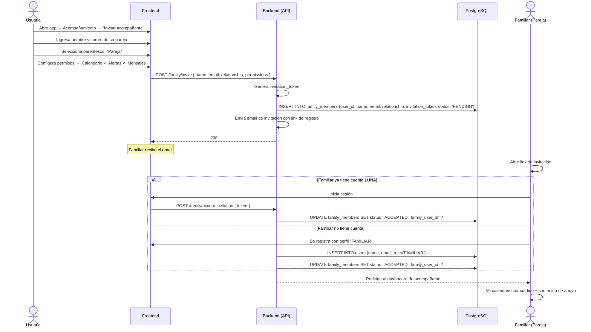

---

## 11. Búsqueda de Profesional

**Descripción**: Una usuaria busca un profesional de la salud cerca de su ubicación, con filtros por especialidad e idioma.

**Actores**: Usuaria, Sistema

**Tablas involucradas**: `professionals`

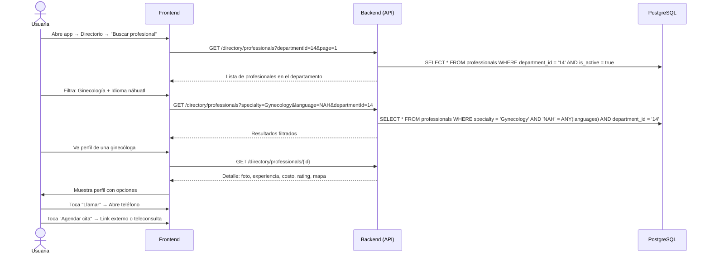

---

## 12. Participación en Foro

**Descripción**: Una usuaria participa en el foro de su etapa, crea un post o comenta.

**Actores**: Usuaria, Sistema, Moderación

**Tablas involucradas**: `forum_posts`, `forum_comments`, `moderation_reports`

```mermaid
sequenceDiagram
    actor U as Usuaria
    participant F as Frontend
    participant B as Backend (API)
    participant DB as PostgreSQL

    U->>F: Abre app → Comunidad
    F->>B: GET /forum/posts?stage=PREGNANCY&page=1
    B->>DB: SELECT * FROM forum_posts WHERE stage = 'PREGNANCY' AND is_published = true ORDER BY created_at DESC
    B-->>F: Lista de posts
    F->>U: Muestra posts con reacciones y comentarios

    U->>F: Toca "Nuevo post"
    U->>F: Escribe título + contenido
    U->>F: Activa "Publicar anónimamente" (opcional)
    F->>B: POST /forum/posts { stage, title, content, isAnonymous }
    B->>B: Filtro automático de contenido inapropiado
    alt Contenido inapropiado detectado
        B->>DB: INSERT INTO forum_posts (is_published=false, reports_count=1)
        B-->>F: 201 "Tu post será revisado por moderación"
        F->>U: "Tu post está pendiente de revisión"
    else Contenido apropiado
        B->>DB: INSERT INTO forum_posts (stage, title, content, is_anonymous, is_published=true)
        B-->>F: 201
        F->>U: Post publicado
    end

    note over U,B: Otro usuario comenta
    Otro as OtraUsuaria
    Otro->>F: Abre post → Escribe comentario
    F->>B: POST /forum/posts/{id}/comments { content }
    B->>DB: INSERT INTO forum_comments (post_id, user_id, content)
    B->>DB: UPDATE forum_posts SET comments_count = comments_count + 1
    B-->>F: 201
```

---

## 13. Exportación de Reporte

**Descripción**: Una usuaria exporta su reporte mensual de salud en PDF para compartir con su médico.

**Actores**: Usuaria, Sistema

**Tablas involucradas**: `health_reports`, `cycles`, `cycle_days`, `symptoms`

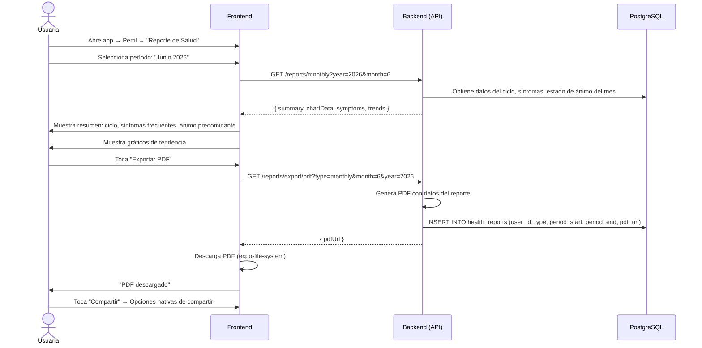

---

## 14. Notificaciones y Recordatorios

**Descripción**: El sistema envía notificaciones push a la usuaria según sus recordatorios configurados y eventos del ciclo.

**Actores**: Sistema, Usuaria

**Tablas involucradas**: `reminders`, `notifications`, `push_devices`

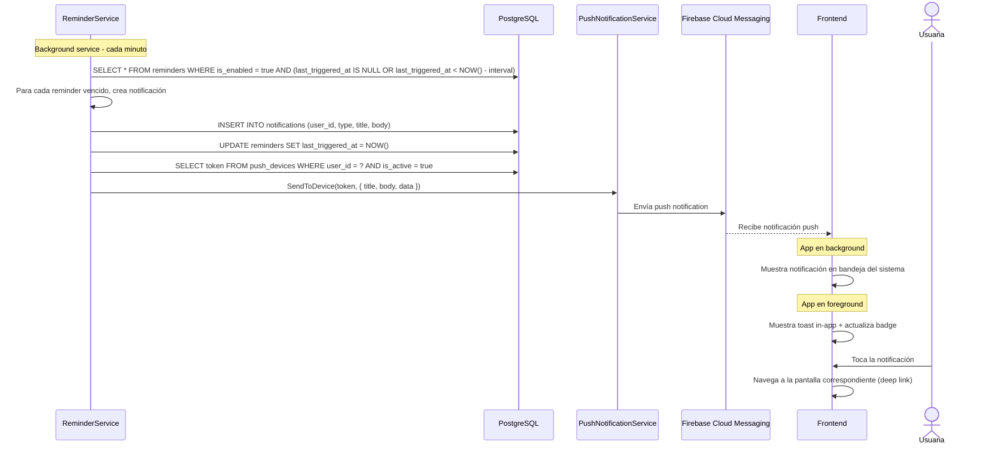

---

## 15. Cambio de Etapa de Vida

**Descripción**: Una usuaria actualiza su etapa de vida (ej: de ciclo activo a embarazo, o a menopausia).

**Actores**: Usuaria, Sistema

**Tablas involucradas**: `users`, `health_profiles`

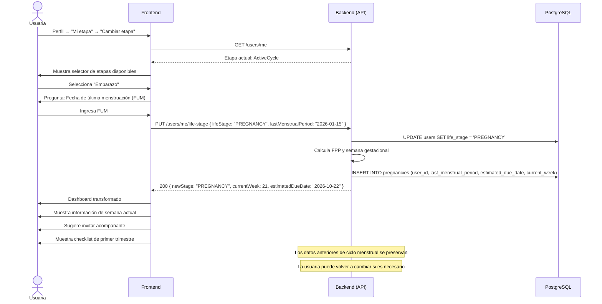
