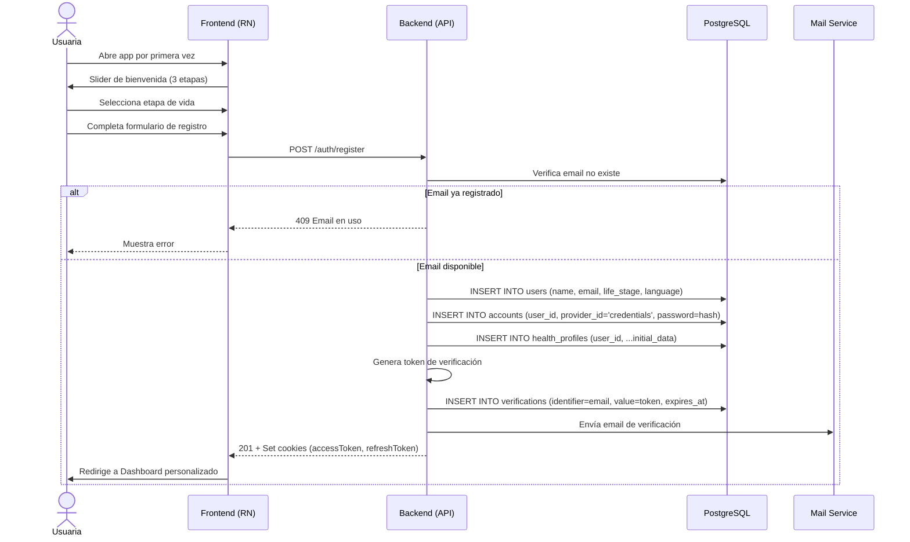

# 1. Registro y Onboarding

**Descripción**: Una nueva usuaria se registra, selecciona su etapa de vida y configura su perfil inicial de salud.

**Actores**: Usuaria no autenticada, Sistema

**Tablas involucradas**: `users`, `accounts`, `sessions`, `health_profiles`, `verifications`

