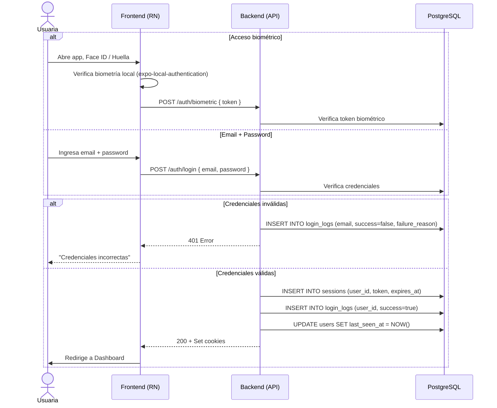

# 2. Inicio de Sesión

**Descripción**: Una usuaria existente inicia sesión con email/password o mediante autenticación biométrica.

**Actores**: Usuaria, Sistema

**Tablas involucradas**: `users`, `accounts`, `sessions`, `login_logs`

