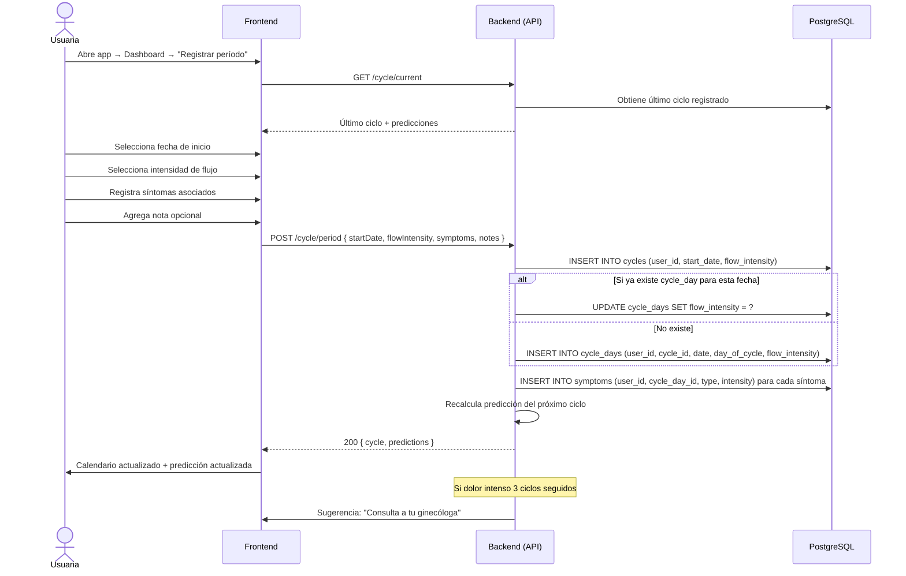

# 3. Registro de Ciclo Menstrual

**Descripción**: Una usuaria registra el inicio de su período menstrual con intensidad de flujo y síntomas.

**Actores**: Usuaria, Sistema

**Tablas involucradas**: `cycles`, `cycle_days`, `symptoms`

