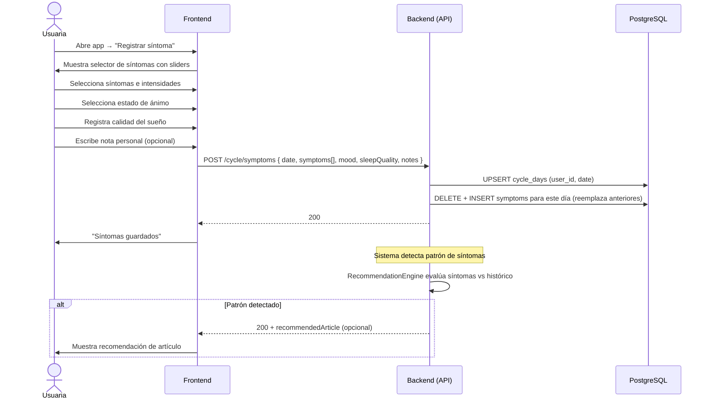

# 4. Registro de Síntomas Diarios

**Descripción**: Una usuaria registra síntomas, estado de ánimo y calidad del sueño en un día específico.

**Actores**: Usuaria, Sistema

**Tablas involucradas**: `cycle_days`, `symptoms`

