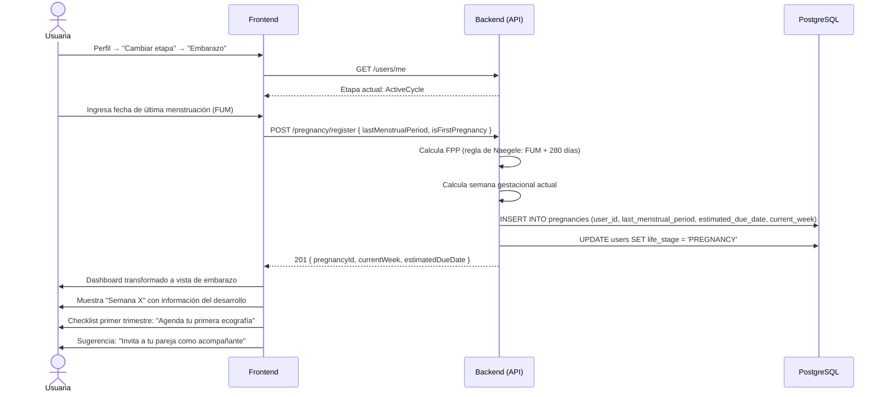

# 6. Inicio de Embarazo

**Descripción**: Una usuaria cambia su etapa a embarazo, ingresa su FUM y el sistema calcula la FPP y semana gestacional.

**Actores**: Usuaria, Sistema

**Tablas involucradas**: `pregnancies`, `appointments`, `users`

