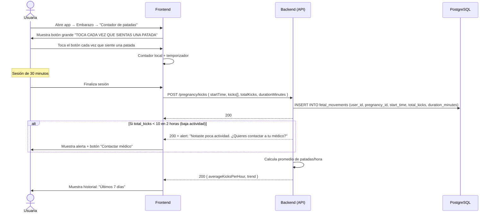

# 7. Registro de Movimientos Fetales

**Descripción**: Una usuaria registra una sesión de conteo de patadas para monitorear la actividad fetal.

**Actores**: Usuaria, Sistema

**Tablas involucradas**: `fetal_movements`

