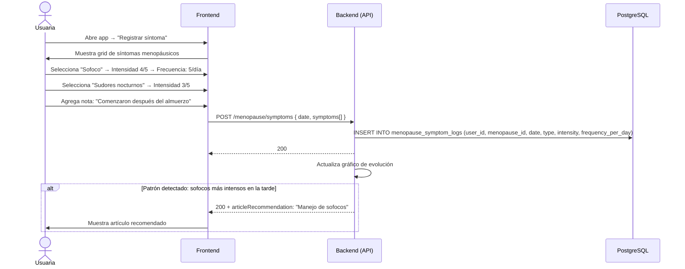

# 8. Registro de Síntomas Menopáusicos

**Descripción**: Una usuaria en etapa de menopausia registra sus síntomas con intensidad y frecuencia.

**Actores**: Usuaria, Sistema

**Tablas involucradas**: `menopause_tracking`, `menopause_symptom_logs`

