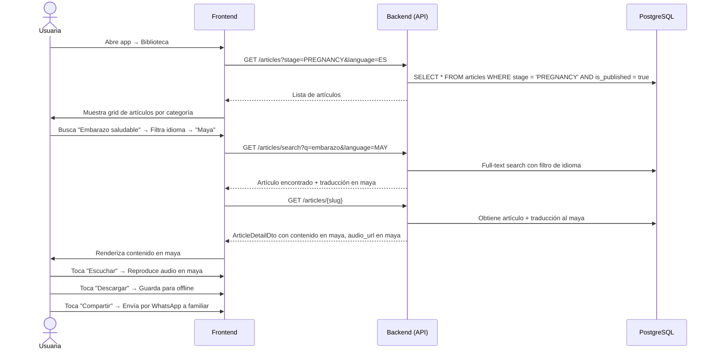

# 9. Lectura de Contenido Educativo

**Descripción**: Una usuaria lee un artículo de la biblioteca, posiblemente en una lengua originaria.

**Actores**: Usuaria, Sistema

**Tablas involucradas**: `articles`, `article_translations`

