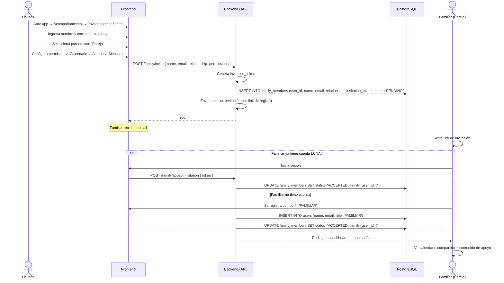

# 10. Invitación de Acompañante

**Descripción**: Una usuaria invita a un familiar como acompañante para que reciba contenido de apoyo y vea su calendario compartido.

**Actores**: Usuaria, Familiar, Sistema

**Tablas involucradas**: `family_members`, `users`, `family_messages`

