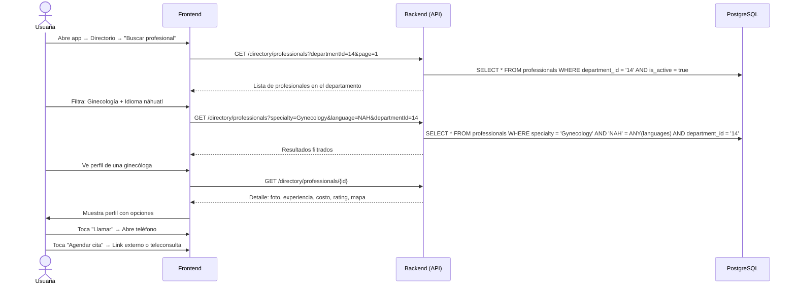

# 11. Búsqueda de Profesional

**Descripción**: Una usuaria busca un profesional de la salud cerca de su ubicación, con filtros por especialidad e idioma.

**Actores**: Usuaria, Sistema

**Tablas involucradas**: `professionals`

