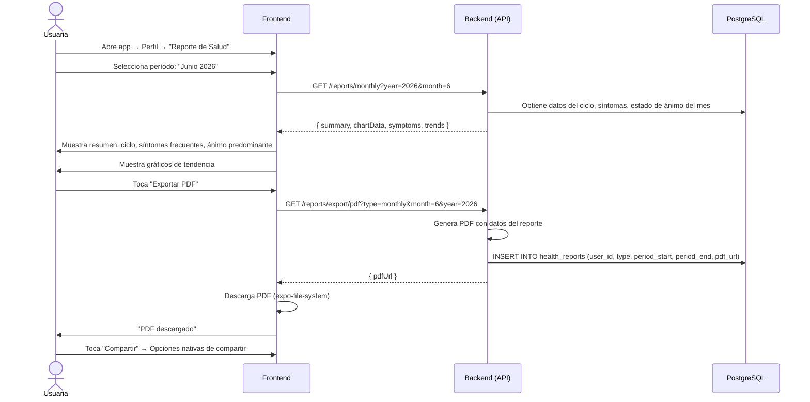

# 13. Exportación de Reporte

**Descripción**: Una usuaria exporta su reporte mensual de salud en PDF para compartir con su médico.

**Actores**: Usuaria, Sistema

**Tablas involucradas**: `health_reports`, `cycles`, `cycle_days`, `symptoms`

