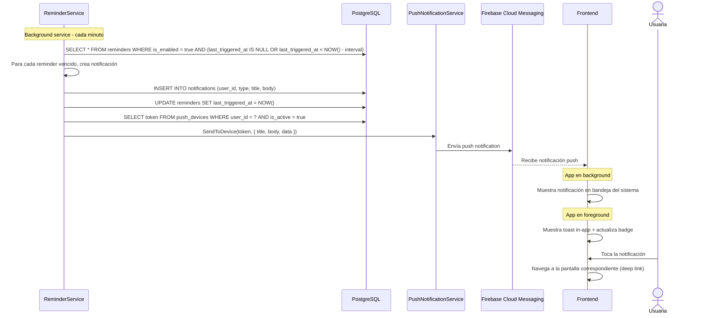

# 14. Notificaciones y Recordatorios

**Descripción**: El sistema envía notificaciones push a la usuaria según sus recordatorios configurados y eventos del ciclo.

**Actores**: Sistema, Usuaria

**Tablas involucradas**: `reminders`, `notifications`, `push_devices`

