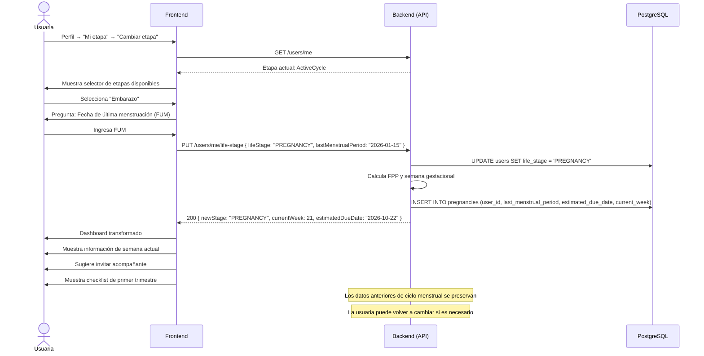

# 15. Cambio de Etapa de Vida

**Descripción**: Una usuaria actualiza su etapa de vida (ej: de ciclo activo a embarazo, o a menopausia).

**Actores**: Usuaria, Sistema

**Tablas involucradas**: `users`, `health_profiles`

